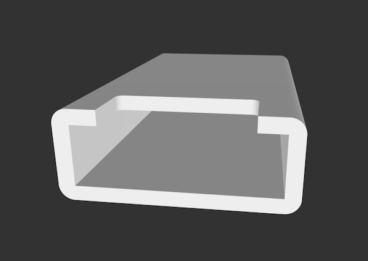
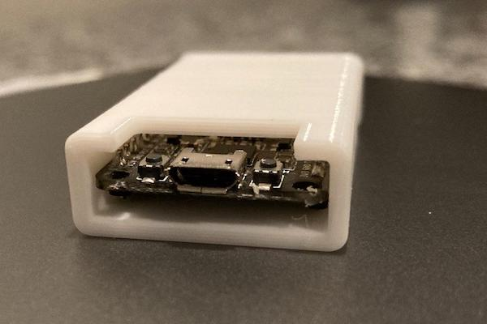
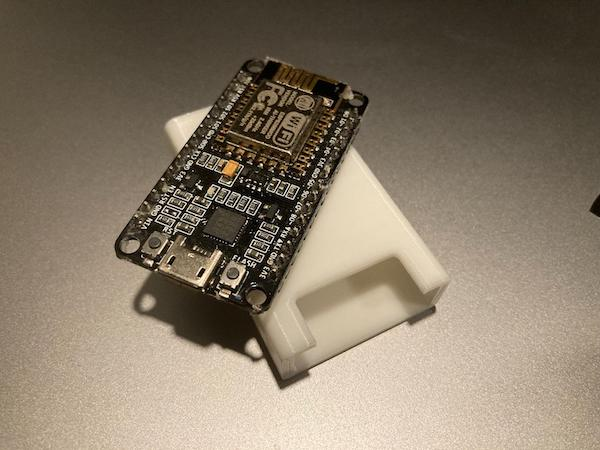
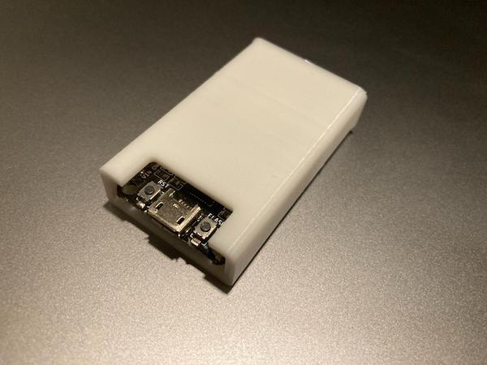

# nodemcu-case

## Description

I had an old and abused NodeMCU microcontroller sitting around.  Despite having lost a few of its GPIO pins, it can still serve a purpose for embedded development on-the-go.  After removing the last few remaining hardware pins with wire cutters, I measured and printed a little plastic sleeve that fits neatly over it.  I then secured the sleeve using some hot glue.

## Additional Photos

> NodeMCU placed on top of its new home.

> Nice and cozy, a perfect fit with buttons still (barely) accessible.